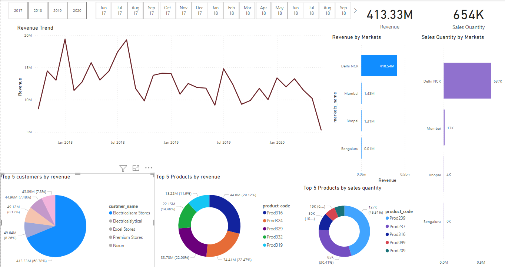
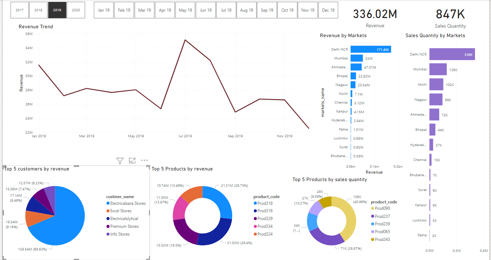

This is a fully interactive Power BI dashboard for viewing sales of 4 years(2017-2021).

Steps followed to make this dashboard are:

1. Import sql data dump into mysql workbench.
2. Explore the data using SQL.
3. Clean the data.
4. Import data into power BI.
5. Perform ETL on data using Power BI transform option.
5. Build dashboard with visualizations for required insights.

